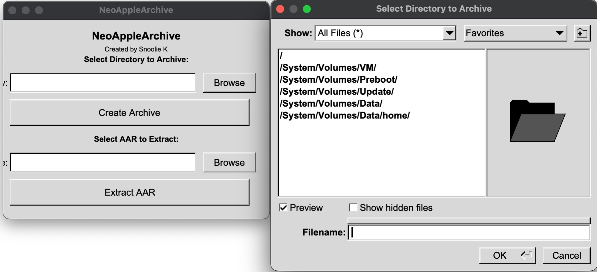

# neoaa-gui
Open-Source Apple Archive GUI tool using [libNeoAppleArchive](https://github.com/0xilis/libNeoAppleArchive). Linux and macOS supported, Windows via MinGW planned.

# Support

- Windows 2000 and newer. (Albeit may work on Windows 9X as well)
- macOS 10.3 Panther and newer.
- Linux
- FreeBSD (Untested)

